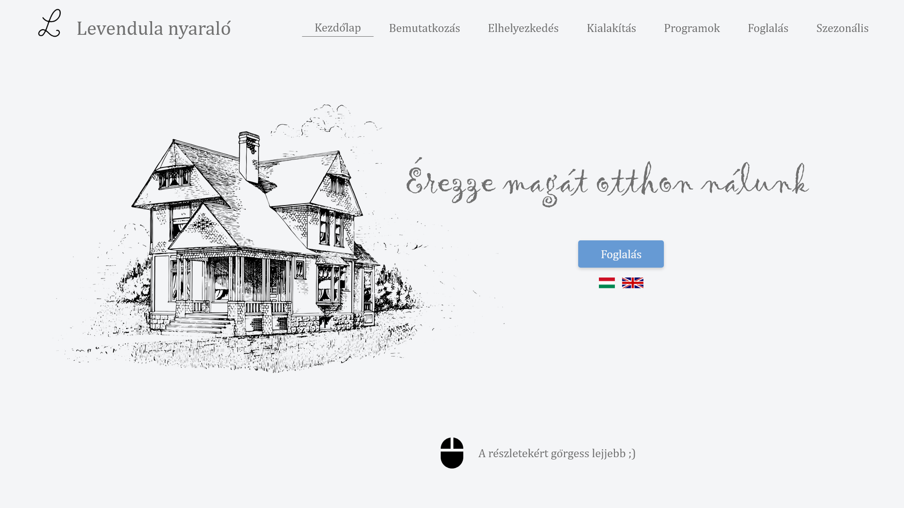

# Lavender website
Lavender summer house one-page frontend application


## About
This repository contains the Lavender Summer House frontend application.

DEV site: http://dev.levendulabalatonmaria.info.s3-website.eu-central-1.amazonaws.com/

PROD site: http://levendulabalatonmaria.info.s3-website.eu-central-1.amazonaws.com/

Please find the backend repos here
 - 
 
 
## Features
 - Start page
 - Introduction
 - Location
 - Inside
 - Activities
 - Booking
 - Seasonal activities
 - Footer
 
### Other features
 - Multi language
 - Rose graph (to visualize distance and activity)
 - Booking service frontend with re-captcha integration
 
## Usage

Install dependencies:
```
npm install
```

Start the website:
```
ng serve
```
